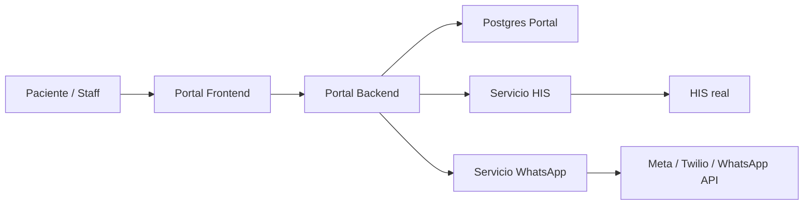
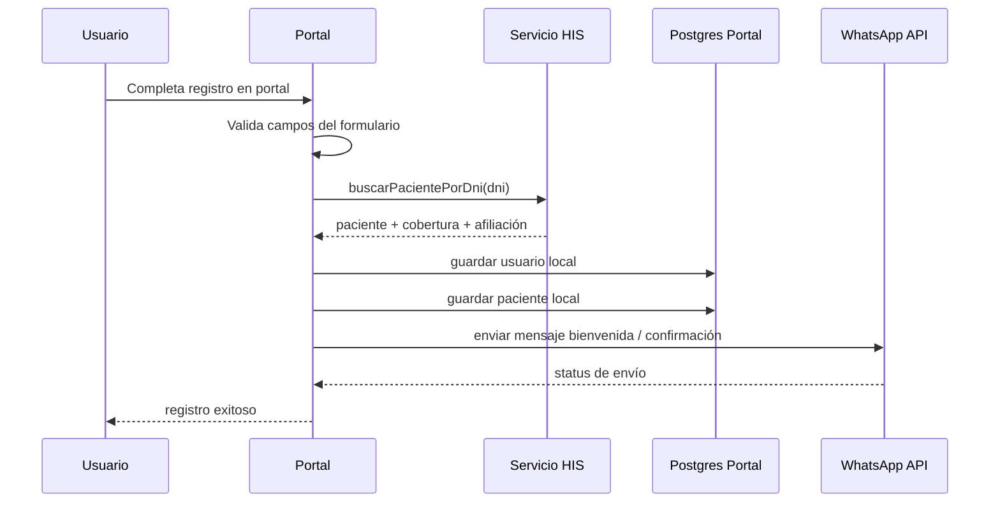
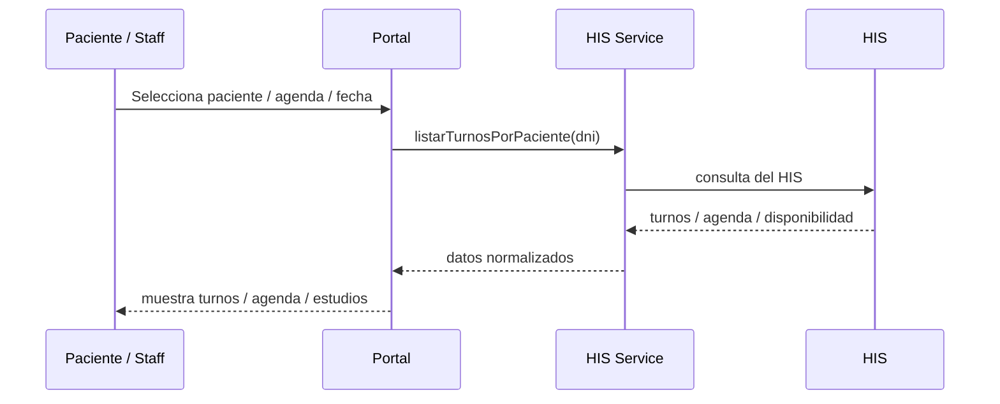
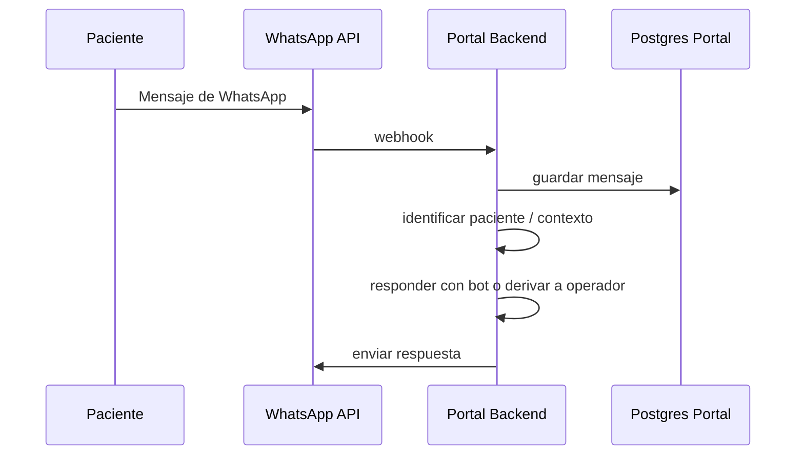

# Arquitectura: Portal + HIS + WhatsApp

## Objetivo

Definir la arquitectura correcta para integrar un portal de pacientes con el HIS, usando PostgreSQL local para persistencia del portal y WhatsApp como canal de comunicación, manteniendo al HIS como fuente de verdad para los datos funcionales del paciente, agendas, turnos, estudios y afiliaciones.

---

## Principio de diseño

1. El HIS es la fuente de verdad funcional.
2. El portal tiene su propia base PostgreSQL para autenticación, sesión, preferencias y registros del sistema.
3. La integración con el HIS se hace por servicios, no por duplicar datos sin control.
4. WhatsApp es un canal de comunicación y notificación, no reemplaza al HIS ni a la base del portal.
5. La comunicación entre portal, HIS y WhatsApp debe estar desacoplada por servicios y endpoints claros.

---

## Arquitectura general



---

## Capas

### 1) Frontend del portal
Responsable de la experiencia del usuario.

Incluye:
- login / sign in
- registro de pacientes
- agenda
- turnos
- estudios
- historial
- mensajes / WhatsApp
- dashboard de paciente y staff

### 2) Backend del portal
Responsable de orquestar el flujo y exponer endpoints.

Endpoints de referencia:
- /api/auth/register
- /api/auth/login
- /api/patients/search
- /api/his/patient
- /api/his/agenda
- /api/his/appointments
- /api/his/studies
- /api/whatsapp/send
- /api/whatsapp/webhook

### 3) Base PostgreSQL del portal
Se usa para:
- usuarios
- sessions / auth
- pacientes locales
- conversaciones de WhatsApp
- estados del flujo
- preferencias
- auditoría de eventos del portal

### 4) Servicio HIS
Es la capa de integración con el sistema central del hospital / prestador.

Funciones típicas:
- buscarPacientePorDni(dni)
- buscarCoberturaPorDni(dni)
- listarAgenda()
- listarTurnosPorPaciente(dni)
- listarEstudiosPorPaciente(dni)
- confirmarTurno(id)
- cancelarTurno(id)

### 5) Servicio WhatsApp
Es la capa para enviar y recibir mensajes.

Funciones típicas:
- enviarMensaje({ to, text })
- enviarTemplate({ to, template, variables })
- enviarConfirmacionTurno({ paciente, turno })
- recibirWebhook(payload)
- guardarMensajeConversacion(payload)

---

## Flujo de registro del paciente



---

## Flujo de agenda y turnos



---

## Flujo de WhatsApp



---

## Estructura sugerida de servicios

```text
src/
  app/
    api/
      auth/
      his/
        patient/
        agenda/
        studies/
      whatsapp/
        send/
        webhook/
  server/
    services/
      his/
        patient-service.ts
        agenda-service.ts
        study-service.ts
      whatsapp/
        whatsapp-service.ts
    db/
      prisma.ts
```

---

## Tipos de servicio recomendados

### patient-service.ts
```ts
export interface PatientHisProfile {
  hisId: string;
  dni: string;
  nombre: string;
  apellido: string;
  sexo?: string;
  fechaNacimiento?: string;
  cobertura?: string;
  plan?: string;
}

export async function buscarPacientePorDni(dni: string): Promise<PatientHisProfile | null> {
  // llamada al servicio del HIS
}
```

### agenda-service.ts
```ts
export interface TurnoHis {
  id: string;
  fecha: string;
  horario: string;
  profesional: string;
  especialidad: string;
  estado: "disponible" | "reservado" | "confirmado";
}

export async function listarTurnosPorPaciente(dni: string): Promise<TurnoHis[]> {
  // llamada al servicio del HIS
}
```

### whatsapp-service.ts
```ts
export interface WhatsappMessagePayload {
  to: string;
  text: string;
}

export async function enviarMensaje(payload: WhatsappMessagePayload) {
  // llamada a Meta / Twilio
}
```

---

## Patrón de integración recomendado

Cada servicio debe cumplir estas reglas:

1. Recibir la entrada del portal.
2. Validar la data mínima.
3. Contactar al HIS o a WhatsApp.
4. Normalizar la respuesta.
5. Devolver un DTO del portal.
6. Manejar errores claros.

Ejemplo de DTO:

```ts
export interface AppointmentDTO {
  id: string;
  date: string;
  time: string;
  doctorName: string;
  specialty: string;
  status: string;
}
```

La normalización es importante porque el portal no debe depender del formato exacto del HIS.

---

## Regla de negocio clave

La validación de identidad debe hacerse por DNI contra el HIS.

El portal local puede guardar los datos del usuario para auth, pero no debe asumir que es la verdad de la afiliación ni del paciente.

Ejemplo:
- Portal guarda: usuario, password, perfil local
- HIS valida: paciente existe, afiliación existe, agenda disponible

---

## Recomendación de MVP

Para empezar, el MVP debería incluir:

- registro con validación por DNI consultando HIS
- login del paciente con usuario local
- servicio de WhatsApp para mensajes automáticos
- servicio de agenda / turnos consultando HIS
- servicio de estudios consultando HIS
- webhook de WhatsApp para recibir mensajes

Esto deja una base sólida y escalable.

---

## Ventaja de esta arquitectura

- el portal no queda acoplado al HIS
- cada dominio tiene su servicio propio
- el HIS puede evolucionar sin romper todo el portal
- WhatsApp se vuelve un canal, no un sistema central
- la base local del portal guarda solo lo necesario para operar la aplicación

---

## Conclusión

La arquitectura correcta para este proyecto es:

- Postgres del portal para persistencia local
- HIS como sistema de negocio y verdad funcional
- WhatsApp como canal de comunicación
- servicios bien separados para cada dominio
- backend que orquesta la integración usando DNI como clave principal de matching

Eso permite crecer sin mezclar responsabilidades ni depender de un único sistema para todo.
