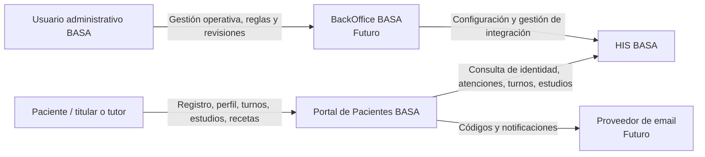
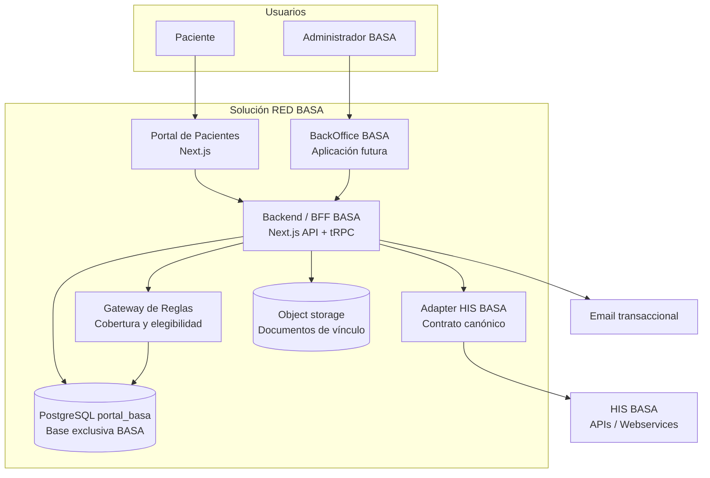
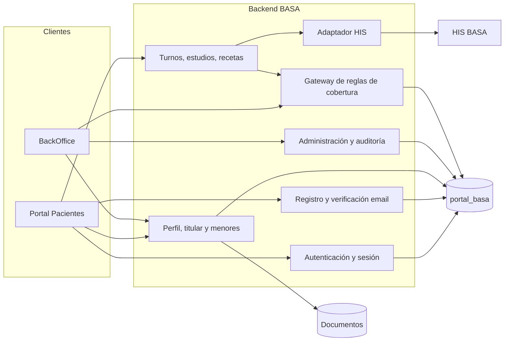
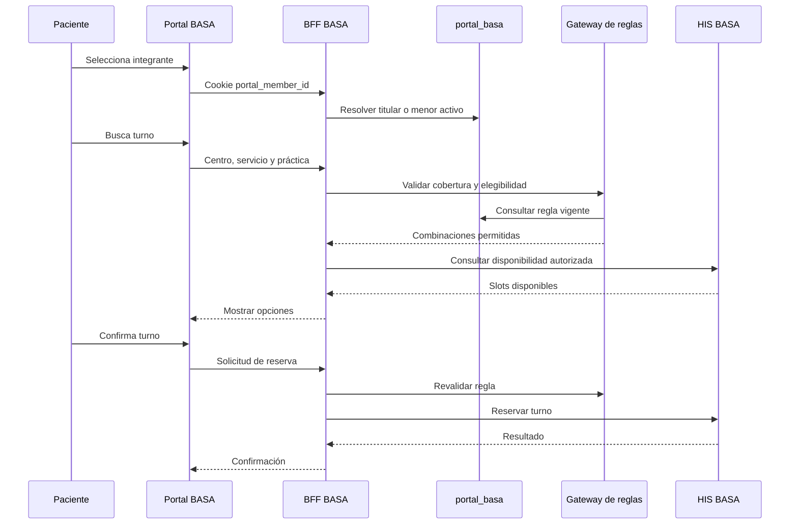
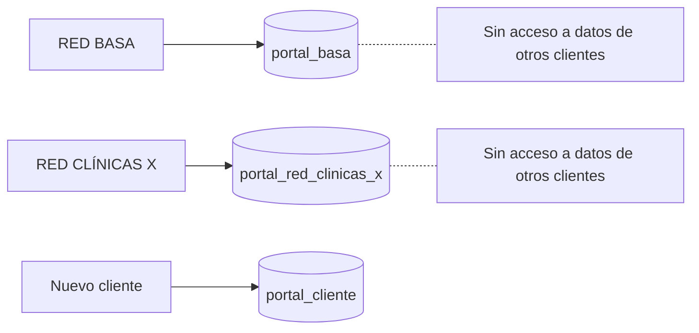

# Diagrama C4 - Solución RED BASA

## Nivel 1 - Contexto del sistema

## Nivel 2 - Contenedores

## Nivel 3 - Componentes del Backend / BFF

## Límites y responsabilidades

| Componente | Responsabilidad | No debe hacer |
|---|---|---|
| Portal Pacientes | Experiencia de autogestión | Decidir reglas de cobertura desde el navegador |
| BackOffice BASA | Gestión, aprobación, configuración y auditoría | Exponer documentos sin autorización |
| Backend / BFF | Autorización, orquestación y validaciones | Acceder a tablas internas del HIS |
| Gateway de reglas | Validar centro, agenda, práctica, financiador y plan | Reemplazar la confirmación final del HIS |
| Adapter HIS | Aislar protocolos, autenticación y mapeos del HIS | Exponer formatos internos al Portal |
| Base `portal_basa` | Datos exclusivos de RED BASA | Mezclar datos de otros clientes |
| HIS BASA | Fuente clínica y operación final de turnos | Ser la fuente de reglas locales no confiables |

## Flujo: reserva de turno con integrante

## Regla de aislamiento por cliente

## Referencias

- [Índice de arquitectura técnica](indice-arquitectura-tecnica-solucion-basa.md)
- [Estructura de base de datos](../ESTRUCTURA%20BASE%20DE%20DATOS.md)
- [Gateway de reglas](../estrategia%20de%20implementacion/estrategia-gateway-reglas-portal.md)
- [Backlog BackOffice](../BACKLOGS/backoffice-basa.md)
